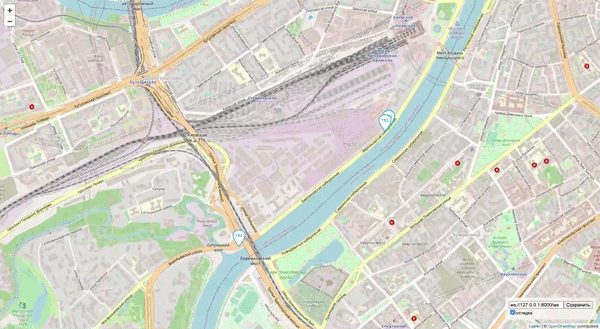

# Автобусы на карте Москвы

Веб-приложение показывает передвижение автобусов на карте Москвы.




## Как запустить

- Скачайте код
- Создайте виртуальное окружение ```python3 -m venv venv```
- Активируйте виртуальное окржуение ```source venv/bin/activate```
- Установить зависимости ```pip install -r requirements.txt```
- Запустите сервер ```python server.py```
- Запустите генератор данных ```python fake_bus.py```
- Откройте в браузере файл `index.html`


## Настройки

В `fake_bus.py` можно регулировать:
 - `server` - адрес сервера
 - `route_number` - количество передаваемых маршртутов
 - `buses_per_route` - количество автобусов на маршруте
 - `websocket_number` - количество веб-сокетов между эмулятором и сервером
 - `emulator_id` - уникальный идентификатор эмулятора
 - `refresh_timeout` - интервал обновления данных
 - `v` - экстра логгирование

В `server.py` можно регулировать:
 - `bus_port` - порт для эмуляторов данных
 - `browser_port` - порт для клиента (браузера)
 - `v` - экстра логгирование
